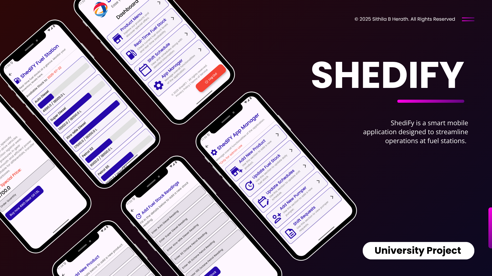

# 📱 FilliFy – Filling Station Management App (University Project)

ShediFy is a smart mobile application designed to streamline operations at fuel stations. 

---

## ✨ Key Features

✅ **User-Specific Secure Logins**  
✅ **Fuel Level Monitoring**  
✅ **Pumper Shift Management**  
✅ **Integrated Online Oil Shop**  

---

## 🛠 Tech Stack

- 💙 **Flutter 3.10** – Cross-platform mobile framework  
- 🔥 **Firebase Firestore** – Cloud database & real-time sync  

---

## 📬 Contact Me

For more information, feedback, or collaboration:

🔗 [Connect on LinkedIn](https://www.linkedin.com/in/sithilxheartz/)

---

